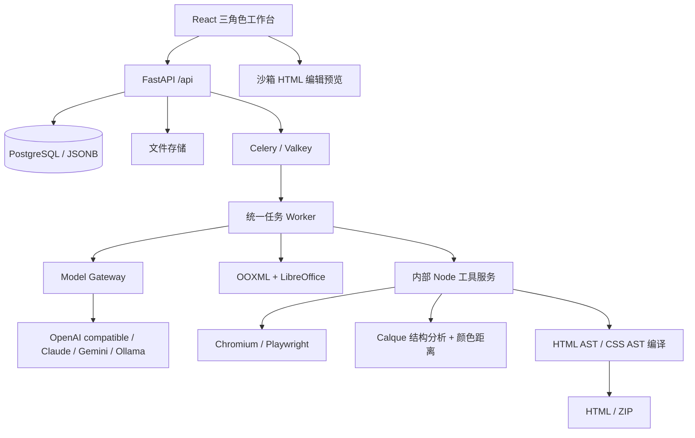

# 实现架构与约束

## 三个上游的实际接入

- OpenStitch：`model_gateway.py` 加载固定版本 `prompts/html_css.py`，删除“plausible data”指令，叠加 Quarkmed 医学来源与设计约束。不加载原项目的 SQLite/WebSocket/用户界面。上游 `diff_apply.py` 保留以供后续评估，本版未用于生产修改（全文候选更容易严格版本检查）。
- screenshot-to-html：`interaction-audit.js` 从 `shot.mjs` 提取真实控件、伪按钮、hover/focus 检查。截图环境与服务调用层由平台实现，不运行上游整个 CLI。数值 Diff 和迭代调度是自有实现。
- Calque：`server.js` 调用 `extract()`，并直接复用 `colour.distance()`。不调用上游强制 resize 的比较函数；尺寸不同用边界填充，报告 mismatch。
- 所有第三方许可证、固定版本保存在 `third_party`。界面中不展示底层工具品牌或 CLI 参数。

## 持久化边界

`page_revisions` 不更新内容；每次保存创建新行。`booklet_snapshots` 保存草稿的页面版本列表和顺序。`submissions.manifest` 冻结提交标题、顺序、页面版本；review_decision 的状态、商务 ID 与意见落在提交行。`exports.manifest` 冻结交付列表，对应一个明确的资产。该 MVP 将计划中的 review_decisions/project_releases 合并进 submissions/exports，避免重复状态源。

用户角色为 users.role，分册负责人为 booklets.owner_id；尚未拆多角色关联表或多人共同负责分册。成员可以只读项目内其它分册，但只能编辑自己负责的分册。管理员资产管理权不等于商务审核权。

写入页面、顺序、模板采用、AI 采用锁定分册；保存再锁定目标页并核对 base_revision_id。提交和草稿修改按同一分册锁串行化。模板副本保留 template_version_id；个人页面库引用固定 revision_id。

## 服务与任务

业务 API 使用同步 SQLAlchemy，上传和 SSE 使用 FastAPI async。Node 工具需要共享内部密钥，生产 Docker 不映射其端口。默认渲染禁止网络请求，输入仅来自统一文档。Celery late ack、拒绝丢失任务与队列 AOF 支持恢复；job status/events 在数据库持久化。取消采用协作方式：当前模型 HTTP 请求可能运行到超时，但每个阶段及最终提交前检查取消，不回写分册。

大任务通过上传资产 ID 传递；任务队列仅传 job ID。完成后的候选与正式页分离，弹窗可重新打开；采用是独立事务。所有导出以请求时冻结的 manifest 编译，不在 Worker 内重新读取最新草稿。

## 数据流

文字/图片 → 上传资产（图片）→ 生成 job → 载入项目/分册/基础版本 → 可选 Calque → 模型 → HTML 规范化 → Chromium → Diff/检查 → 候选 → 用户采用 → 页面新 revision → 保存/排序快照 → 提交 manifest → 商务审核 → 导出 manifest → 单 DOM 长页/ZIP。

PPTX → 原文件资产 → OOXML → 完整参考 PDF + 无本地对象的母版背景 PDF → 可编辑基础 HTML + 复杂图像 → 真实渲染比较 → 待检查模板版本 → 管理员发布 → 一般人员导入副本。
